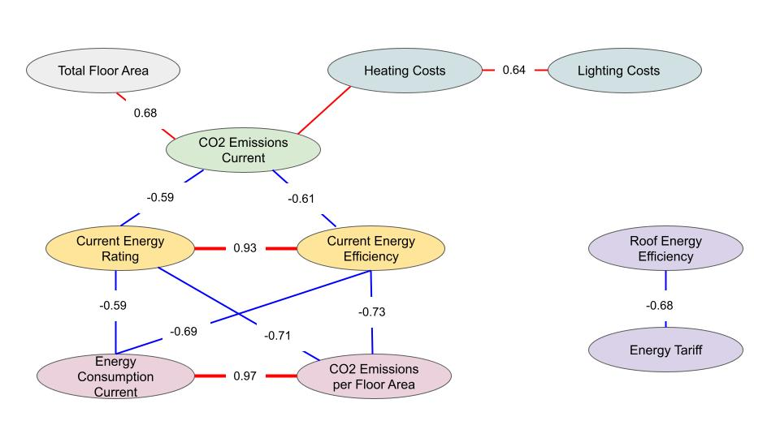

# Supervised Model to Predict Heat Pump Adoption

## Goals

The goal of this branch of the project is to build a supervised model for predicting heat pump adoption in domestic housing.

A static model predicts whether a single household will likely get a heat pump in the future, while a temporal model will predict the growth in heat pump installations for a given area (postcode) over a specific time.

We hope to gain insights into heat adoption on a temporal level and aim to identify factors that inhibit or accelerate heat pump adoption.

## Data

Data used for this model

- Preprocessed EPC data (Version Nesta 2021)
- Index of Multiple Deprivation: IMD Rank, Income Score, Employment Score
- MCS data for exact HP installation date

To Do:

- [ ] Add few more description features, e.g. wall cavity type
- [ ] EPC/MCS: fine-tune merging parameter
- [ ] Include more socio-demographic data (e.g. Acorn)

## Data Processing

### Feature Inspection and Selection

We have 67 features from the EPC dataset. Some of them are redudant as they are either constructed from another feature (e.g. Energy Rating Category from Current Energy Rating) or are highly correlated (e.g. Energy Consumption Crrent and CO2 Emissions per Floor Area).

The correlation matrix below shows the correlation between a reduced set of features. For the full matrix, check folder `/outputs/figures/correlation_matrix_complete.png`. The matrix allows us to identify a number of highly correlated features that bring additional information to the feature space, for example, lodgement date (highly correlated with inspection date).

This chart shows an example for highly correlated features.

While interesting to analyse the correlations between features, we only discard few features using this method with very high correlations: LODGEMENT_DATE, INSPECTION_DATE (as string), CURR_ENERGY_RATING_NUM, ENERGY_RATING_CAT, UNIQUE_ADDRESS, MAINHEAT_DESCRIPTION, MAINHEAT_SYSTEM.

### Target Variables

For the static model that predicts the current heat pump status of a property, the target variable is HP_INSTALLED. The features HP_SYSTEM, HP_TYPE and HP_INSTALLED are derived from MAINHEAT_DESCRIPTION (describing the current heating system) and strongly corrlate with them and thus all of them need to be removed from the training data X.

For predicting the future heat pump status, we need properties with at least two EPC entries, e.g. one before the heat pump installation and one after. The target variable is HP_INSTALLED of the latest EPC entry.
For this model, removing the feature related to MAINHEAT_DESCRIPTION do not necessarily need to be removed, although we discard some of them due to redundancy.

---

For the temporal model, possible target varaibles are the percentage of properties with a heat pump in a given area (HP coverage) or the growth between time _t_ and time _t+1_. As we accumulate the HP installations, the growth is always positive.

**Issue**

- The EPC Registry only represents 50% of the properties in GB.
- We currently have no official data for how many properties there are per postcode

So how do we normalise the number of properties with heat pumps per postcode in order to gain the HP coverage?

##### Option a)

We normalise by the number of properties with EPC entry up to time _t_ or _t+1_, respectively.
However, if many properties are added to EPC between _t_ and _t+1_, this can cause negative growth.

_Example:_
Postcode XYZ contains 5 properties at time t (e.g. year 2012) and 20 properties at time t+1 (e.g. 2013).
At time t: 3 out of 5 properties have HP (60% coverage)
At time t+1 : 10 out of 20 properties have HP (50% coverage)
Growth: -10%

##### Option b)

We normalise by the number of properties with EPC entry at time _t+1_. This guarantees positive growth and better comparabilty.

_Example_
Number of properties at time t+1: 20
At time t: 3 out of 20 properties have HP (15% coverage)
At time t+1 : 10 out of 20 properties have HP (50% coverage)
Growth: +35%

However, when predicting for several time windows, the results are not necessarily comporable because the number of properties at time t+1 varies with t. Growth may be "watered down" in later years as more and more properties with EPC adre added.
Also, it ignores the actual real-world number of properties per postcode.

#### Option c)

We normalise by the number of total EPC entries for that postcode, not just entries up to t+1. This allows for continious comparisons across years.

_Example_
Number of properties (overall EPC): 50
At time t: 3 out of 50 properties have HP (6% coverage)
At time t+1 : 10 out of 50 properties have HP (20% coverage)
Growth: +14%

However, when comparing smaller time windows the growth is less visible.

##### Option d)

We normalise by the real-world number of properties. However, we discard this option for the time beeing for the following reasons:

- We currently on have an approximation for the number of properties per postcode
- The representation of properties in the EPC registry may vary per postcode, with some postcodes being completely covered by EPC and others not at all. This could give a skewed view on the adoption and growth.
- The number of real-world properties comes from a different "dimension", not connected to the EPC registry.

### Feature Encoding

We have two types of features: numerical and categorical features. A numerical feature consists of numbers, for example the TOTAL*FLOOR_AREA. A categorical feature consists of differente categories, for example \_owner-occupied* or _social rental_ for TENURE or _very poor_ to _very good_ for WINDOW_ENERGY_EFFICIENCY.

Numeric features do not require any special encoding.

#### Ordinal Encoding

Categorical features can be divided two groups: those with a natural ordering and those without. For instance, the WINDOW ENERGY EFFICIENCY categories _very poor_, _poor_, _average_, _good_ and _very good_ have a natural relationship so the categories can be ranked or ordered.

We apply ordinal encoding to those features using manually created rankings. The different categories are given integer values in ascending order, starting with 1.

The follow features are ordinal encoded:
`MAINHEAT_ENERGY_EFF", "CURRENT_ENERGY_RATING", "POTENTIAL_ENERGY_RATING", "FLOOR_ENERGY_EFF", "WINDOWS_ENERGY_EFF", "HOT_WATER_ENERGY_EFF", "LIGHTING_ENERGY_EFF", "GLAZED_TYPE", "MAINHEATC_ENERGY_EFF", "WALLS_ENERGY_EFF", "ROOF_ENERGY_EFF", "MAINS_GAS_FLAG", "CONSTRUCTION_AGE_BAND_ORIGINAL", "CONSTRUCTION_AGE_BAND", "N_ENTRIES", "N_ENTRIES_BUILD_ID", "ENERGY_RATING_CAT"`

#### One-Hot Encoding

The remaining categorical features are one-hot encoded.

For features with a large number of categories, e.g. GLAZED TYPE, we first reduce the number of categories by merging them. For example, `double glazing, unknown install date`, `double, unknown data` and `double glazing` are all mapped to _double glazing_.

### Feature Aggregation

For the temporal model, we need to aggregate the features on postcode level.
Short version:

- For numerical features, we take the median
- For categorical ones, we get the % of properties with that category

_More detailed description follows_

### Preprocessing

Since most machine learning models cannot handle NaN values, we impute the filling in the mean of the repsective feature's values.

Since we have a large feature space (= large number of features), we perform dimensionality reduction using PCA (Principal Component Analysis). We keep the number of principal components sum to an explained variance ratio of 90%.

In case of the static model, this is reduces the number of features from 87 to 24.

Finally, we standardise our data using a Min-Max scaler.

To Do:

- [ ] More sophistical way for data imputing

### Training Data

For the static model that predicts the current heat pump status, we can include...

_To be completed_

## Models and Performance

### Static HP Model

### Temporal HP Model

## Some notes (will be deleted):

- How to deal with NaN? Set to 0, -1, 999? Drop?
- Optimise balance vs. representativness
- Try different ratios
- variance of samples in negative samples reflects variance of population
- for numeric; mean or median, more rigourosly NAn values
- also try with imbalanced set, 99%

- predict change in following years
- time window: larger windows to predict next year(s)
- do predictors change over time?

- What about prediction probabiltities for linear model? What do households on decision boundary look like?

- Feature ablation: if not sure about feature, remove and look at influence
