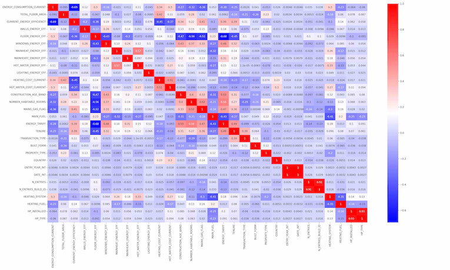
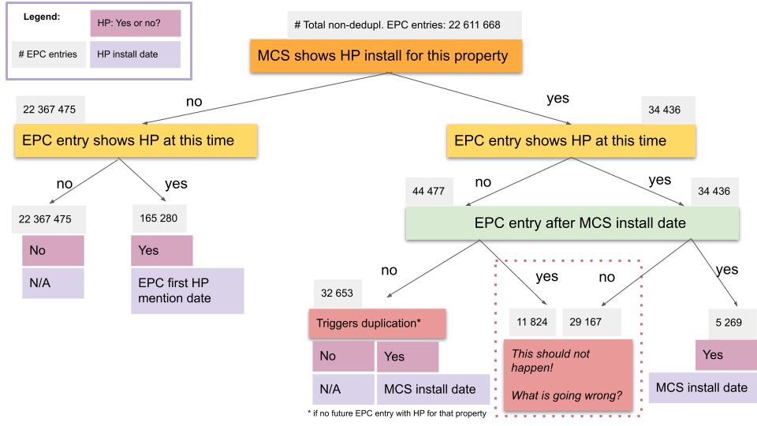
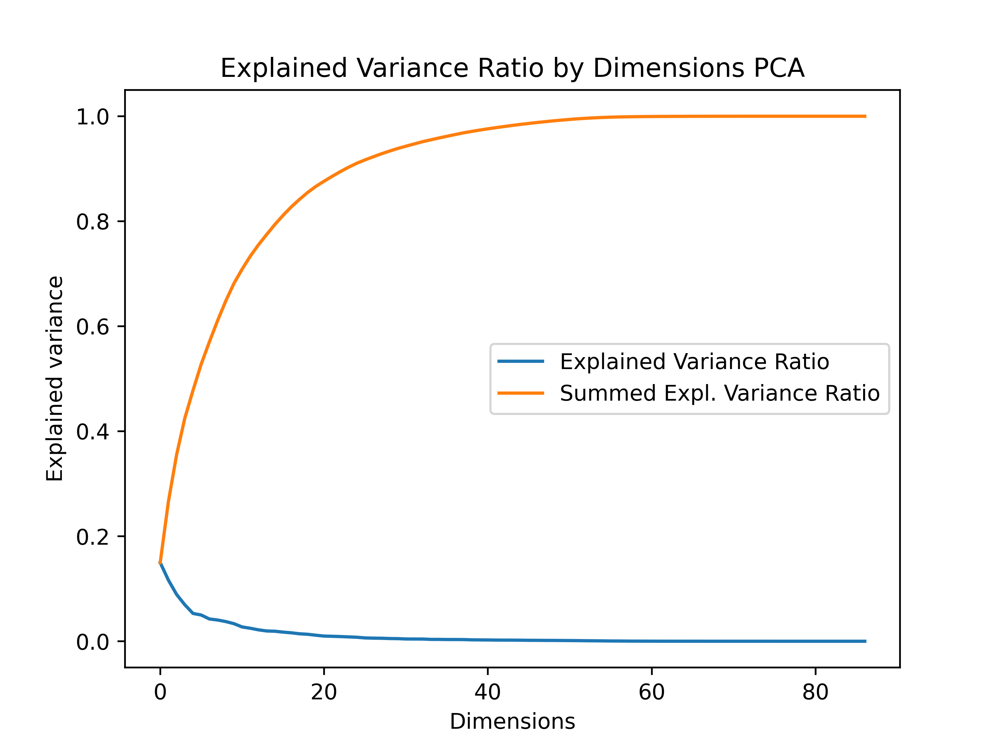
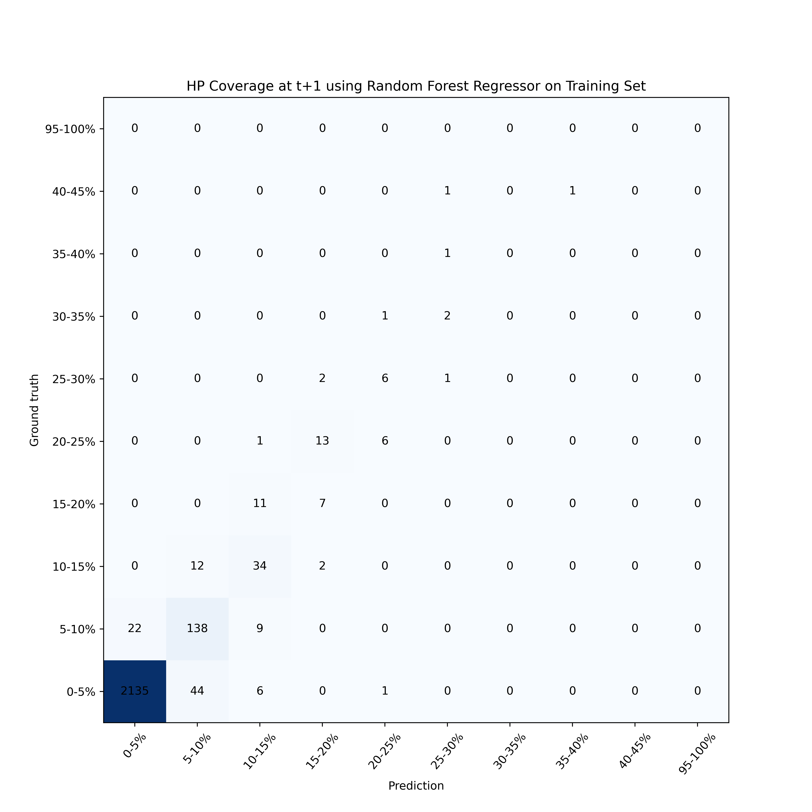
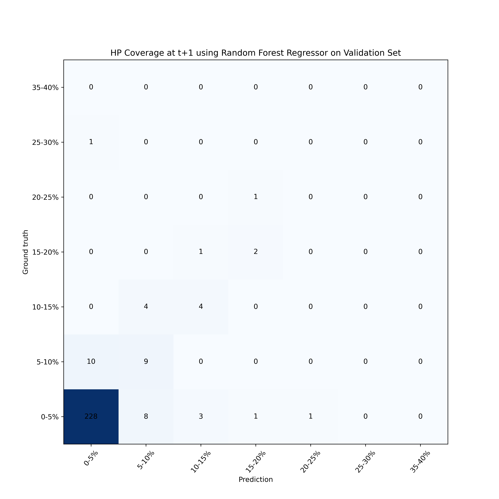

# Supervised Model to Predict Heat Pump Adoption

## Goals

The goal is to build a supervised learning model that predicts heat pump adoption in domestic housing, based on characteristics of current heat pump adopters. A supervised model learns patterns from examples for which both input data and outcome are known in order to predict the outcome for unseen input data, e.g. predicting the heat pump status of a property based on its building characteristics.

A static model predicts whether a single household has a heat pump installed or will get a heat pump at a later point. It uses historical data to make these predictions. This allows us to identify features that are suitable for predicting heat pump uptake and study the influence of social versus building features.

The temporal model predicts the growth in heat pump installations for a given area at a postcode level over a specific time period. We hope to gain insights into the growth of heat pump adoption on a temporal level, identify accelerators and inhibitors of heat pump adoption and explore why certain areas show a much higher or lower heat pump uptake than predicted.

## Data

Data used for this model:

- EPC data for England, Wales and Scotland, preprocessed using code from [asf-core-data](https://github.com/nestauk/asf_core_data) package
- Information about MCS-certified heat pump installations derived from the MCS Installations Database
- Index of Multiple Deprivation data for [England](https://www.gov.uk/government/statistics/english-indices-of-deprivation-2019), [Wales](https://gov.wales/welsh-index-multiple-deprivation) and [Scotland](https://www.gov.scot/publications/scottish-index-of-multiple-deprivation-2020v2-indicator-data/): IMD Rank, Income Score and Employment Score

You can learn more about these datasets and how to access them in the [asf-core-data](https://github.com/nestauk/asf_core_data) reopsitory.

## Data Processing

### Feature Inspection and Selection

We have 67 features from the EPC dataset. Some of them are redudant as they are either constructed from another feature (e.g. Energy Rating Category from Current Energy Rating) or are highly correlated (e.g. Energy Consumption Crrent and CO2 Emissions per Floor Area).

The correlation matrix below shows the correlation between a reduced set of features. For the full matrix, check folder `/outputs/figures/correlation_matrix_complete.png`. The matrix allows us to identify a number of highly correlated features that bring additional information to the feature space, for example, lodgement date (highly correlated with inspection date).

This chart shows an example for highly correlated features.

While interesting to analyse the correlations between features, we only discard few features using this method: `LODGEMENT_DATE`, `CURR_ENERGY_RATING_NUM`, `ENERGY_RATING_CAT`, `UNIQUE_ADDRESS`, `MAINHEAT_DESCRIPTION`, `MAINHEAT_SYSTEM`.

### Integration of MCS Installation Dates

Of the 136 407 MCS installations left after preprocessing, we were able to match 80% with an EPC register entry using the address line. For EPC entries with MCS matches we update the heat pump status and installation date if necessary. We process the different cases according to this flowchart.

### Target Variables

For the static model that predicts the current heat pump status of a property, the target variable is `HP_INSTALLED`. The features `HP_SYSTEM`, `HP_TYPE` and `HP_INSTALLED` are derived from `MAINHEAT_DESCRIPTION` (describing the current heating system) and strongly corrlate with them and thus all of them need to be removed from the training data.

For predicting the future heat pump status, we need properties with at least two EPC entries, e.g. one before the heat pump installation and one after. The target variable is `HP_INSTALLED` of the latest EPC entry.
For this model, removing the features related to `MAINHEAT_DESCRIPTION` do not necessarily need to be removed, although we discard some of them due to redundancy.

---

For the temporal model, possible target variables are the percentage of properties with a heat pump in a given area (HP coverage) or the growth between source and target time. As we accumulate the HP installations, the growth is always positive.

**Issue**

- The EPC Registry only represents 50% of the properties in GB.
- We currently have no official data for how many properties there are per postcode

So how do we normalise the number of properties with heat pumps per postcode in order to gain the HP coverage?

##### Option a)

We normalise by the number of properties with EPC entry up to time _t_ or _t+1_, respectively.
However, if many properties are added to EPC between _t_ and _t+1_, this can cause negative growth.

_Example:_
Postcode XYZ contains 5 properties at time t (e.g. year 2012) and 20 properties at time t+1 (e.g. 2013).
At time t: 3 out of 5 properties have HP (60% coverage)
At time t+1 : 10 out of 20 properties have HP (50% coverage)
Growth: -10%

##### Option b)

We normalise by the number of properties with EPC entry at time _t+1_. This guarantees positive growth and better comparabilty.

_Example_
Number of properties at time t+1: 20
At time t: 3 out of 20 properties have HP (15% coverage)
At time t+1 : 10 out of 20 properties have HP (50% coverage)
Growth: +35%

However, when predicting for several time windows, the results are not necessarily comporable because the number of properties at time t+1 varies with t. Growth may be "watered down" in later years as more and more properties with EPC adre added.
Also, it ignores the actual real-world number of properties per postcode.

#### Option c)

We normalise by the number of total EPC entries for that postcode, not just entries up to t+1. This allows for continious comparisons across years.

_Example_
Number of properties (overall EPC): 50
At time t: 3 out of 50 properties have HP (6% coverage)
At time t+1 : 10 out of 50 properties have HP (20% coverage)
Growth: +14%

However, when comparing smaller time windows the growth is less visible.

##### Option d)

We normalise by the real-world number of properties. However, we discard this option for the time beeing for the following reasons:

- We currently on have an approximation for the number of properties per postcode
- The representation of properties in the EPC registry may vary per postcode, with some postcodes being completely covered by EPC and others not at all. This could give a skewed view on the adoption and growth.
- The number of real-world properties comes from a different "dimension", not connected to the EPC registry.

### Feature Encoding

We have two types of features: numerical and categorical features. A numerical feature consists of numbers, for example the `TOTAL_FLOOR_AREA`. A categorical feature consists of differente categories, for example _owner-occupied_ or _social rental_ for `TENURE` or _very poor_ to _very good_ for `WINDOW_ENERGY_EFFICIENCY`.

Before one hot encoding: 56 features
After one hot encoding: 180 features

#### Numerical Features

Numeric features do not require any special encoding:

`'IMD Rank', 'IMD Decile', 'Income Score', 'Employment Score', 'ENERGY_CONSUMPTION_CURRENT', 'TOTAL_FLOOR_AREA', 'CURRENT_ENERGY_EFFICIENCY', 'CO2_EMISSIONS_CURRENT', 'HEATING_COST_CURRENT', 'HOT_WATER_COST_CURRENT', 'LIGHTING_COST_CURRENT', 'FLOOR_HEIGHT', 'EXTENSION_COUNT', 'FLOOR_LEVEL', 'GLAZED_AREA', 'NUMBER_HABITABLE_ROOMS', 'MAIN_HEATING_CONTROLS', 'MULTI_GLAZE_PROPORTION', 'PHOTO_SUPPLY', 'WIND_TURBINE_COUNT', 'DIFF_POT_ENERGY_RATING'`

#### Ordinal Encoding

Categorical features can be divided two groups: those with a natural ordering and those without. For instance, the WINDOW ENERGY EFFICIENCY categories _very poor_, _poor_, _average_, _good_ and _very good_ have a natural relationship so the categories can be ranked or ordered.

We apply ordinal encoding to those features using manually created rankings. The different categories are given integer values in ascending order, starting with 1.

The follow features are ordinal encoded:

`'MAINHEAT_ENERGY_EFF', 'CURRENT_ENERGY_RATING', 'POTENTIAL_ENERGY_RATING', 'FLOOR_ENERGY_EFF', 'WINDOWS_ENERGY_EFF', 'HOT_WATER_ENERGY_EFF', 'LIGHTING_ENERGY_EFF', 'GLAZED_TYPE', 'MAINHEATC_ENERGY_EFF', 'WALLS_ENERGY_EFF', 'ROOF_ENERGY_EFF', 'MAINS_GAS_FLAG', 'CONSTRUCTION_AGE_BAND_ORIGINAL', 'CONSTRUCTION_AGE_BAND', 'ENERGY_RATING_CAT'`

#### One-Hot Encoding

The remaining categorical features are one-hot encoded.

For features with a large number of categories, e.g. GLAZED TYPE, we first reduce the number of categories by merging them. For example, `double glazing`, `double, unknown data` and `double glazing` are all mapped to _double glazing_.

`'SECONDHEAT_DESCRIPTION', 'MECHANICAL_VENTILATION', 'ENERGY_TARIFF', 'SOLAR_WATER_HEATING_FLAG', 'TENURE', 'TRANSACTION_TYPE', 'BUILT_FORM', 'PROPERTY_TYPE', 'COUNTRY', 'HEATING_SYSTEM', 'HEATING_FUEL'`

### Feature Aggregation

For the temporal model, we need to aggregate the features on postcode level.
In short:

- For numerical features, we take the median
- For categorical ones, we get the % of properties with that category
- For categorical features, we also compute to most frequent value

### Preprocessing

Since most machine learning models cannot handle NaN values, we impute the filling in the mean of the repsective feature's values.

Since we have a large feature space (= large number of features), we perform dimensionality reduction using PCA (Principal Component Analysis). We keep the number of principal components sum to an explained variance ratio of 90%.

In case of the static model, this is reduces the number of features from 87 to 24.

Finally, we standardise our data using a Min-Max scaler.

## Models and Performance

### HP Status on Household Level

Heat pumps are still rare and less than 1% of the EPC records include one. Thus, we need to rebalance the training and test set. We upsample the properties with heat pumps to 20%, leaving 80% without heat pumps.

#### Predicting Current HP Status

In our first experiment, we predict whether a property has a heat pump installed, i.e. the current heat pump status of a property. In the next experiment, we predict whether a property without a heat pump will have a heat pump installed by end of 2021, i.e. the future HP status.

With a Linear Support Vector Classifier we achieve the following results.

Number of samples: 50115
Number of features: 172

| Metric    | Train | Test |
| --------- | ----- | ---- |
| Accuracy  | 0.94  | 0.94 |
| Precision | 0.87  | 0.87 |
| Recall    | 0.84  | 0.84 |
| F1-score  | 0.86  | 0.84 |

The recall is slightly worse than the precision, meaning that more properties with a heat pump are incorrectly labelled than properties without a heat pump.

 

 

For predicting the current heat pump status of a property, the heating fuel is the most relevant feature: if the heating fuel is electric, it is probably that the property has a heat pump; if the heating fuel is gas, it is very unlikely to have a heat pump installed. Heat pumps are more likely in owner-occupied houses and bungalows and social housing related to green deals. Heat pumps are rare in lower income areas in older properties on the gas grid.

#### Predicting Future HP Status

In the previous experiment, we predict whether a property has a heat pump installed, i.e. the current heat pump status of a property. In this experiment, we predict whether a property without a heat pump will have a heat pump installed by end of 2021, i.e. the future HP status.

With a Linear Support Vector Classifier we achieve the following results.

Number of samples: 214475
Number of features: 80

| Metric    | Train | Test |
| --------- | ----- | ---- |
| Accuracy  | 0.88  | 0.88 |
| Precision | 0.72  | 0.71 |
| Recall    | 0.64  | 0.64 |
| F1-score  | 0.68  | 0.68 |

The recall is slightly worse than the precision, meaning that more properties with a heat pump are incorrectly labelled than properties without a heat pump. The system is better at predicting where there is no heat pump, due to the unbalanced set.

When predicting the future heat pump status, the strongest indicators are the property types house and bungalow, followed by (semi-)detached houses and social housing. The strongest negative indicators are properties on the gas grid and/or with gas as heating fuel, as well as low income, old and private rental properties.

### HP Growth on Postcode Level

#### Discussion

### HP Growth on Postcode Level

#### Results

**HP Coverage**

| Model                           | SME mean | Standard Deviation | Accuracy on 5% steps |
| ------------------------------- | -------- | ------------------ | -------------------- |
| SVM Regressor train             | 0.064    | 0.010              | 0.24                 |
| SVM Regressor test              |          |                    | 0.22                 |
| Linear Regression train         | 0.041    | 0.010              | 0.86                 |
| Linear Regression test          |          |                    | 0.82                 |
| Decision Tree Regressor train\* | 0.049    | 0.010              | 1.0                  |
| Decision Tree Regressor test\*  |          |                    | 0.86                 |
| Random Forest Regressor train   | 0.043    | 0.006              | 0.94                 |
| Random Forest Regressor test    |          |                    | 0.89                 |

- not parameter-screened yet

**Growth**

| Model                           | SME mean | Standard Deviation | Accuracy on 5% steps |
| ------------------------------- | -------- | ------------------ | -------------------- |
| Linear Regression train         | 0.020    | 0.002              | 0.96                 |
| Linear Regression test          |          |                    | 0.96                 |
| Decision Tree Regressor train\* | 0.049    | 0.010              | 1.00                 |
| Decision Tree Regressor test\*  |          |                    | 0.93                 |
| Random Forest Regressor train   | 0.012    | 0.002              | 0.98                 |
| Random Forest Regressor test    |          |                    | 0.95                 |

## Error Analysis

- How well do models perform?
- Where do they go wrong?
- What can False Positives tell us?
- Decision tree?

#### To Do

- [ ] X: ground truth, y : error, relatiive error
- [ ] Map with predictions, ground truths and errors
- [ ] Pick interesting postcodes
- [ ] Predict until 2025
- [ ] Plot decision tree
